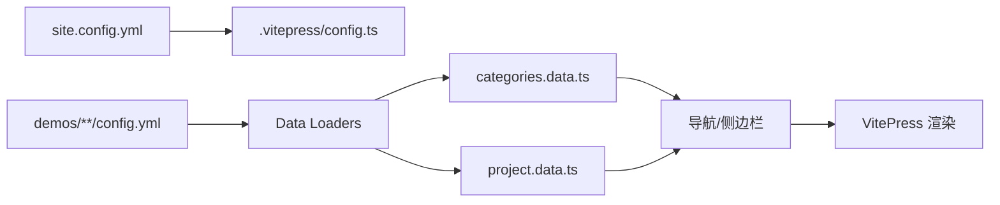

# CodeView 架构详解

## 核心架构

CodeView 是一个基于 VitePress 的 Demo 展示平台，采用三级分层架构：

```
站点配置 (site.config.yml)
    ↓
分类 (Category)
    ↓
项目 (Project)
    ↓
版本 (Version)
```

## 数据流

### 1. 配置加载流程



#### 配置文件层级

| 层级 | 文件路径 | 作用 |
|------|---------|------|
| **站点** | `site.config.yml` | 全局配置（标题、联系方式等） |
| **分类** | `demos/[category]/config.yml` | 分类信息（标题、图标、描述） |
| **项目** | `demos/[category]/[project]/config.yml` | 项目配置（标题、标签、版本列表） |
| **版本** | `demos/[category]/[project]/[version]/config.yml` | 版本详情（演示地址、截图） |

### 2. 页面生成流程

CodeView 在构建时自动生成所有页面的 Markdown 文件：

```typescript
// .vitepress/config.ts 启动时执行

syncCategories()  // 1. 扫描分类目录
    ↓
loadProjects()    // 2. 加载每个分类下的项目
    ↓
syncProject()     // 3. 为每个项目生成 index.md
    ↓
syncVersionDir()  // 4. 为每个版本生成 index.md
```

**生成的页面：**

| 页面类型 | 生成位置 | 模板函数 |
|---------|---------|---------|
| 首页 | `index.md` | `homepageMd()` |
| 分类总览 | `demos/index.md` | `categoriesOverviewMd()` |
| 分类页 | `demos/[category]/index.md` | `categoryPageMd()` |
| 项目页 | `demos/[category]/[project]/index.md` | `projectPageMd()` |
| 版本页 | `demos/[category]/[project]/[version]/index.md` | `versionPageMd()` |

### 3. 版本自动管理

系统自动检测并同步版本目录：

```typescript
// reconcileVersions() 函数负责：

1. 扫描项目目录下的子目录 → 发现版本
2. 将新版本添加到 config.yml
3. 删除不存在的版本配置
4. 自动标记最新版本 (latest: true)
```

**版本排序规则：** 使用语义化版本排序，如 `v2.0 > v1.5 > v1.0`

## 核心模块

### 1. 工具函数 (.vitepress/utils/shared.ts)

| 函数 | 功能 |
|------|------|
| `readYml<T>(path)` | 读取并解析 YAML 文件 |
| `dirs(parent)` | 获取目录下的所有子目录（过滤隐藏文件） |
| `findLogo(dir, urlBase)` | 查找目录下的 logo 文件 |
| `versionSort(a, b)` | 版本号排序 |
| `scanImagePlatforms(dir)` | 扫描 images 目录，返回平台列表 |
| `scanImageMap(dir, urlBase)` | 扫描 images，返回平台 → 图片 URL 映射 |

### 2. 模板生成 (.vitepress/utils/templates.ts)

包含 5 个模板函数，每个函数返回对应页面的 Markdown 内容：

```typescript
// 示例：项目页模板
export function projectPageMd(config: ProjectConfig, basePath: string): string {
  return `---
title: ${config.title}
---

# ${config.title}

${config.desc || ''}

<VersionTabs
  :versions='${JSON.stringify(config.versions)}'
  current=""
  base-path="${basePath}/"
/>
`
}
```

### 3. Data Loaders (.vitepress/data/)

VitePress Data Loaders 在构建时加载数据，可在组件中通过 `import { data } from ...` 使用。

#### categories.data.ts

```typescript
// 加载所有分类及其项目
export interface Category {
  name: string
  text: string
  icon?: string
  logo?: string
  desc?: string
  projects: Project[]
}
```

#### project.data.ts

```typescript
// 加载所有项目的完整配置（包含版本详情）
export interface AllProjects {
  [key: string]: {  // key = "category/project"
    project: ProjectData
    versions: { [ver: string]: VersionData }
  }
}
```

使用示例：

```vue
<script setup>
import { data as allProjects } from '../.vitepress/data/project.data'
const info = allProjects['app/chat-app']
const config = info.versions['v1.0']
</script>

<template>
  <div>{{ config.title }}</div>
</template>
```

## Vite 插件

### 1. demosWatcher - 开发时热更新

监听 `demos/` 目录变化，当检测到 `config.yml` 或图片变化时，清除缓存并触发重新构建。

```typescript
// 监听文件类型：
- *.yml           → 配置变更
- *.png/jpg/webp  → 图片变更
- rename 事件     → 目录结构变更
```

### 2. copyDemosImages - 构建时复制图片

在构建完成后，将 `demos/` 下的所有图片复制到 `dist/demos/`，保持相同目录结构。

## 图片处理流程

```bash
# 构建时自动执行
pnpm build
    ↓
scripts/compress-images.sh  # 1. 压缩图片为 webp
    ↓
vitepress build             # 2. 构建站点
    ↓
copyDemosImages()           # 3. 复制图片到 dist
```

**压缩规则：**
- 扫描 `demos/` 下所有 `.jpg/.png/.bmp`
- 使用 cwebp 转换为 webp（质量 80）
- 删除原图，保留 webp

## 导航与侧边栏构建

### 导航栏 (nav)

```typescript
// 结构：分类 → 项目列表
nav = [
  {
    text: "刷单系列",
    items: [
      { text: "刷单系列 总览", link: "/demos/app/" },
      { text: "TK商城刷单", link: "/demos/app/chat-app/" }
    ]
  }
]
```

### 侧边栏 (sidebar)

```typescript
// 按路径分组，展示项目 → 版本
sidebar["/demos/app/"] = [{
  text: "刷单系列",
  items: [{
    text: "TK商城刷单",
    collapsed: false,
    items: [
      { text: "v1.0 (最新)", link: "/demos/app/chat-app/v1.0/" }
    ]
  }]
}]
```

## 关键特性

### 1. 自动化

- 自动扫描目录结构生成页面
- 自动检测版本变化并更新配置
- 自动标记最新版本
- 自动压缩图片

### 2. 热更新

开发模式下，修改 `config.yml` 或添加图片会自动触发重新加载（2 秒防抖）。

### 3. 类型安全

所有配置、数据加载器、组件 Props 都有完整的 TypeScript 类型定义。

### 4. 搜索优化

支持中文分词搜索，使用 `Intl.Segmenter` API 进行智能分词。

## 扩展点

### 添加新的配置字段

1. 在 `shared.ts` 中更新接口定义
2. 在模板函数中使用新字段
3. 在 Data Loader 中加载新字段

### 添加新组件

1. 在 `.vitepress/theme/components/` 创建组件
2. 在 `.vitepress/theme/index.ts` 中注册
3. 在模板中使用

### 自定义构建流程

在 `.vitepress/config.ts` 的 `vite.plugins` 中添加自定义插件。
