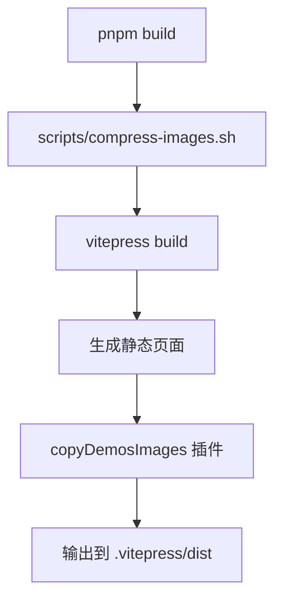

# 构建系统与部署

## 构建流程

### 完整构建命令

```bash
pnpm build
```

### 构建步骤详解



#### 步骤 1: 图片压缩

**脚本：** `scripts/compress-images.sh`

```bash
#!/bin/bash
# 压缩 demos 目录下所有图片为 webp 格式

DEMOS_DIR="demos"
QUALITY=80

# 查找所有 jpg/png/bmp 图片
find "$DEMOS_DIR" -type f \( -iname "*.jpg" -o -iname "*.png" -o -iname "*.bmp" \) | while read img; do
  webp="${img%.*}.webp"

  # 如果 webp 已存在且比原图新,跳过
  if [ -f "$webp" ] && [ "$webp" -nt "$img" ]; then
    continue
  fi

  # 使用 cwebp 压缩
  cwebp -q "$QUALITY" "$img" -o "$webp" -quiet

  # 删除原图
  rm "$img"
done
```

**功能：**
- 扫描 `demos/` 下所有 `.jpg/.png/.bmp` 图片
- 使用 `cwebp` 转换为 WebP 格式（质量 80）
- 删除原图，保留 WebP
- 跳过已压缩的图片（基于文件修改时间）

**依赖：**

需要安装 `cwebp` 工具：

```bash
# macOS
brew install webp

# Ubuntu/Debian
apt-get install webp

# Windows
# 从 https://developers.google.com/speed/webp/download 下载
```

**跳过压缩：**

如果不需要图片压缩，可以直接运行：

```bash
pnpm vitepress build
```

#### 步骤 2: VitePress 构建

**命令：** `vitepress build`

**执行流程：**

1. **加载配置** (`.vitepress/config.ts`)
   ```typescript
   // 构建时执行
   const categories = syncCategories()  // 扫描并生成分类页面
   const projectsMap = loadProjects()   // 加载所有项目
   ```

2. **同步配置文件**
   - 自动创建缺失的 `config.yml`
   - 自动检测并更新版本列表
   - 自动标记最新版本

3. **生成 Markdown 页面**
   - 首页：`index.md`
   - 分类总览：`demos/index.md`
   - 分类页：`demos/[category]/index.md`
   - 项目页：`demos/[category]/[project]/index.md`
   - 版本页：`demos/[category]/[project]/[version]/index.md`

4. **构建导航与侧边栏**
   ```typescript
   const nav = categories.map(cat => ({ text, items }))
   const sidebar = { [path]: [{ text, items }] }
   ```

5. **编译 Vue 组件和 Markdown**
   - 处理所有 `.md` 文件
   - 编译 Vue 组件
   - 生成静态 HTML

6. **优化资源**
   - 代码分割
   - CSS 提取
   - 资源压缩

#### 步骤 3: 复制图片资源

**插件：** `copyDemosImages()` (`.vitepress/config.ts`)

```typescript
function copyDemosImages(): Plugin {
  return {
    name: 'codeview-copy-images',
    closeBundle() {
      // 构建完成后执行
      copyImages(demosDir, resolve(distDir, 'demos'))
    }
  }
}
```

**功能：**
- 递归复制 `demos/` 下的所有图片到 `dist/demos/`
- 保持目录结构不变
- 只复制图片文件（`.jpg/.jpeg/.png/.gif/.webp/.svg/.bmp`）

### 构建输出

```
.vitepress/dist/
├── assets/            # CSS/JS 资源
├── demos/             # Demo 图片资源
│   ├── app/
│   │   └── chat-app/
│   │       └── v1.0/
│   │           └── images/
│   │               ├── pc/
│   │               └── mobile/
│   └── web/
├── index.html         # 首页
└── demos/
    ├── index.html     # 分类总览
    └── app/
        ├── index.html # 分类页
        └── chat-app/
            ├── index.html  # 项目页
            └── v1.0/
                └── index.html  # 版本页
```

---

## 开发服务器

### 启动命令

```bash
pnpm dev
# 或
pnpm vitepress dev
```

### 开发服务器特性

#### 1. 热更新 (HMR)

- Markdown 文件修改 → 立即刷新
- Vue 组件修改 → 热替换（无需刷新）
- 配置文件修改 → 完全重载

#### 2. 配置文件监听

**插件：** `demosWatcher()` (`.vitepress/config.ts`)

```typescript
function demosWatcher(): Plugin {
  return {
    name: 'codeview-watcher',
    configureServer() {
      const watcher = fsWatch(demosDir, { recursive: true }, (event, filename) => {
        // 监听 demos/ 目录变化
        if (filename.endsWith('.yml') || isImageFile(filename) || event === 'rename') {
          // 清除缓存，触发重新加载
          rmSync(cacheDir, { recursive: true })
          utimesSync(configFilePath, new Date(), new Date())
        }
      })
    }
  }
}
```

**监听的变化：**

| 文件类型 | 触发条件 | 响应 |
|---------|---------|------|
| `*.yml` | 配置文件修改 | 清除缓存，重新扫描 |
| `*.png/jpg/webp` | 图片添加/删除 | 更新截图列表 |
| `rename` | 目录重命名/创建/删除 | 重新扫描结构 |
| `*.md` | Markdown 修改 | 不触发（VitePress 自动处理） |

**防抖处理：**

- 延迟 2 秒执行，避免频繁重载
- 忽略构建后 3 秒内的变化

#### 3. Data Loader 缓存

VitePress 会缓存 Data Loader 的结果到 `.vitepress/cache/`。

**清除缓存：**

```bash
rm -rf .vitepress/cache
```

---

## 部署

### 1. 静态托管（推荐）

构建后将 `.vitepress/dist` 目录部署到任意静态托管服务。

#### Vercel

```bash
# 安装 Vercel CLI
npm i -g vercel

# 部署
vercel --prod
```

**配置 `vercel.json`：**

```json
{
  "buildCommand": "pnpm build",
  "outputDirectory": ".vitepress/dist",
  "cleanUrls": true
}
```

#### Netlify

**配置 `netlify.toml`：**

```toml
[build]
  command = "pnpm build"
  publish = ".vitepress/dist"

[[redirects]]
  from = "/*"
  to = "/index.html"
  status = 200
```

#### GitHub Pages

**方法 1: GitHub Actions（推荐）**

参见项目中的 `.github/workflows/blank.yml`：

```yaml
name: Deploy GitHub Pages

on:
  push:
    branches: [master]

jobs:
  build-and-deploy:
    runs-on: ubuntu-latest
    steps:
      - name: Checkout
        uses: actions/checkout@v4

      - name: Install pnpm
        uses: pnpm/action-setup@v2
        with:
          version: 10

      - name: Setup Node.js
        uses: actions/setup-node@v4
        with:
          node-version: '24'
          cache: 'pnpm'

      - name: Build
        run: pnpm install && pnpm build

      - name: Deploy
        uses: JamesIves/github-pages-deploy-action@v4
        with:
          token: ${{ secrets.PAGES_TOKEN }}
          branch: gh-pages
          folder: .vitepress/dist
```

**方法 2: 手动部署**

```bash
# 构建
pnpm build

# 部署到 gh-pages 分支
cd .vitepress/dist
git init
git add -A
git commit -m 'deploy'
git push -f git@github.com:username/repo.git master:gh-pages
```

### 2. Docker 容器

**Dockerfile：**

```dockerfile
FROM node:24-alpine as builder

WORKDIR /app
COPY package.json pnpm-lock.yaml ./
RUN npm i -g pnpm && pnpm install

COPY . .
RUN pnpm build

FROM nginx:alpine
COPY --from=builder /app/.vitepress/dist /usr/share/nginx/html
EXPOSE 80
```

**构建并运行：**

```bash
docker build -t codeview .
docker run -p 8080:80 codeview
```

### 3. Nginx 服务器

**构建：**

```bash
pnpm build
```

**Nginx 配置：**

```nginx
server {
    listen 80;
    server_name demo.example.com;

    root /var/www/codeview/dist;
    index index.html;

    # 支持 Clean URLs
    location / {
        try_files $uri $uri.html $uri/ =404;
    }

    # 缓存静态资源
    location ~* \.(jpg|jpeg|png|gif|webp|svg|css|js|woff|woff2|ttf)$ {
        expires 1y;
        add_header Cache-Control "public, immutable";
    }
}
```

**部署步骤：**

```bash
# 上传构建产物
scp -r .vitepress/dist/* user@server:/var/www/codeview/dist/

# 重启 Nginx
ssh user@server 'sudo systemctl reload nginx'
```

---

## 环境变量

### 构建时变量

可在构建命令中设置环境变量：

```bash
# 设置 base URL
BASE_URL=/subpath/ pnpm build

# 跳过图片压缩
SKIP_COMPRESS=1 pnpm build
```

### VitePress 配置

在 `.vitepress/config.ts` 中读取：

```typescript
export default defineConfig({
  base: process.env.BASE_URL || '/',
  // ...
})
```

---

## 性能优化

### 1. 图片优化

**已实施：**
- WebP 格式转换（减少 30-50% 体积）
- 质量 80 压缩

**建议：**
- 截图使用标准分辨率（PC: 1920x1080, Mobile: 750x1334）
- 单张图片不超过 500KB

### 2. 代码分割

VitePress 自动按页面分割代码，无需额外配置。

### 3. CDN 加速

将 `dist/assets/` 和 `dist/demos/` 上传到 CDN：

```nginx
# Nginx 配置
location /assets/ {
    proxy_pass https://cdn.example.com/assets/;
}

location /demos/ {
    proxy_pass https://cdn.example.com/demos/;
}
```

### 4. Gzip 压缩

**Nginx 配置：**

```nginx
gzip on;
gzip_types text/plain text/css application/json application/javascript text/xml application/xml;
gzip_min_length 1000;
```

---

## 故障排查

### 构建失败

#### 1. 图片压缩失败

**错误：** `cwebp: command not found`

**解决：**
```bash
# 安装 cwebp
brew install webp  # macOS
apt-get install webp  # Linux

# 或跳过压缩
pnpm vitepress build
```

#### 2. 内存不足

**错误：** `JavaScript heap out of memory`

**解决：**
```bash
# 增加 Node.js 内存限制
NODE_OPTIONS="--max-old-space-size=4096" pnpm build
```

#### 3. TypeScript 错误

**错误：** 配置文件类型错误

**解决：**
```bash
# 检查类型
pnpm tsc --noEmit

# 更新依赖
pnpm update
```

### 开发服务器问题

#### 1. 热更新不工作

**解决：**
```bash
# 清除缓存
rm -rf .vitepress/cache

# 重启服务器
pnpm dev
```

#### 2. 端口占用

**错误：** `Port 5173 is already in use`

**解决：**
```bash
# 指定端口
pnpm vitepress dev --port 3000
```

### 部署问题

#### 1. 404 错误

**原因：** `cleanUrls` 配置与服务器不匹配

**解决：**

确保服务器支持 Clean URLs（参见上方 Nginx 配置）。

#### 2. 图片 404

**原因：** 图片未复制到 `dist/`

**解决：**
```bash
# 检查插件是否执行
pnpm build 2>&1 | grep "已复制 demos 图片"

# 手动复制
cp -r demos/**/*.webp .vitepress/dist/demos/
```

---

## CI/CD 集成

### GitHub Actions 完整示例

```yaml
name: CI/CD

on:
  push:
    branches: [master]
  pull_request:
    branches: [master]

jobs:
  lint:
    runs-on: ubuntu-latest
    steps:
      - uses: actions/checkout@v4
      - uses: pnpm/action-setup@v2
        with:
          version: 10
      - uses: actions/setup-node@v4
        with:
          node-version: '24'
          cache: 'pnpm'
      - run: pnpm install
      - run: pnpm tsc --noEmit

  build:
    runs-on: ubuntu-latest
    needs: lint
    steps:
      - uses: actions/checkout@v4
      - uses: pnpm/action-setup@v2
        with:
          version: 10
      - uses: actions/setup-node@v4
        with:
          node-version: '24'
          cache: 'pnpm'
      - run: pnpm install
      - run: pnpm build
      - uses: actions/upload-artifact@v4
        with:
          name: dist
          path: .vitepress/dist

  deploy:
    runs-on: ubuntu-latest
    needs: build
    if: github.ref == 'refs/heads/master'
    steps:
      - uses: actions/download-artifact@v4
        with:
          name: dist
          path: dist
      - uses: JamesIves/github-pages-deploy-action@v4
        with:
          token: ${{ secrets.GITHUB_TOKEN }}
          branch: gh-pages
          folder: dist
```

---

## 构建脚本参考

### package.json

```json
{
  "scripts": {
    "dev": "vitepress dev",
    "build": "bash scripts/compress-images.sh && vitepress build",
    "preview": "vitepress preview",
    "compress": "bash scripts/compress-images.sh",
    "build:no-compress": "vitepress build",
    "clean": "rm -rf .vitepress/dist .vitepress/cache"
  }
}
```

### Makefile

```makefile
.PHONY: dev build deploy clean

dev:
	pnpm vitepress dev

build:
	pnpm build

preview:
	pnpm vitepress preview

deploy: build
	rsync -avz --delete .vitepress/dist/ user@server:/var/www/codeview/

clean:
	rm -rf .vitepress/dist .vitepress/cache
```
